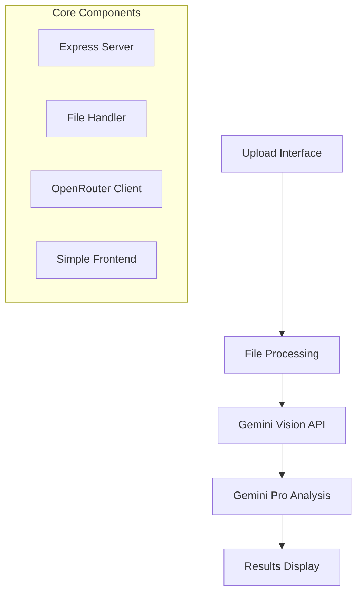

# Course Checker - Simplified Architecture Plan

## Project Overview
A Node.js web application that helps teachers automatically correct student exams using AI analysis via Google's Gemini models through OpenRouter API.

## Core Functionality (MVP)

### Essential Features
1. **File Upload**: Accept PDF and image files
2. **AI Processing**: Use Gemini Vision + Gemini Pro for analysis
3. **Results Display**: Show basic score and highlighted errors
4. **Simple Interface**: Clean, professional web interface

## Simplified Architecture



## Technical Stack
- **Backend**: Node.js + Express.js
- **Frontend**: HTML/CSS/JavaScript (vanilla or simple framework)
- **AI**: Gemini models via OpenRouter
- **File Processing**: Multer + PDF-parse + Sharp

## Project Structure
```
course_checker/
├── server.js              # Main server file
├── public/                # Static files (HTML, CSS, JS)
├── uploads/               # Temporary file storage
├── services/
│   ├── fileProcessor.js   # Handle file uploads/conversion
│   ├── aiService.js       # OpenRouter integration
│   └── analyzer.js        # Core analysis logic
└── package.json
```

## Implementation Steps

### Phase 1: Basic Setup
1. Initialize Node.js project
2. Set up Express server with file upload
3. Create simple HTML interface
4. Configure OpenRouter API connection

### Phase 2: Core Processing
1. Implement PDF to image conversion
2. Integrate Gemini Vision for text extraction
3. Add Gemini Pro for analysis and correction
4. Create basic results display

### Phase 3: Polish
1. Improve UI/UX
2. Add error handling
3. Optimize performance
4. Test with various file types

## Key Simplifications
- **No Database**: Store results temporarily in memory/files
- **Single User**: No authentication system initially
- **Basic UI**: Focus on functionality over advanced styling
- **Local Storage**: No cloud storage integration
- **Minimal Dependencies**: Keep package.json lean

## Success Criteria
- Teachers can upload exam files (PDF/images)
- System extracts content using Gemini Vision
- AI analyzes and identifies errors using Gemini Pro
- Results show basic score with highlighted mistakes
- Interface is clean and professional

This simplified approach focuses on delivering core value quickly while maintaining clean, readable code.