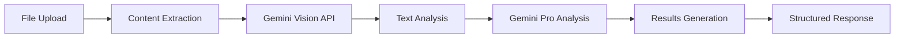

<div align="center">
  
  
  # 🎓 Course Checker
  
  **AI-Powered Exam Correction Platform for Educators**
  
  [](https://opensource.org/licenses/MIT)
  [](https://nodejs.org/)
  [](https://expressjs.com/)
  [](https://ai.google.dev/)
  
  *Revolutionize your grading process with intelligent AI analysis*
  
  [🚀 Quick Start](#-quick-start) • [✨ Features](#-features) • [📖 Documentation](#-documentation) • [🐳 Docker](#-docker-deployment)
</div>

---

## 🌟 Overview

Course Checker is an innovative web application that transforms the way educators correct student exams. By leveraging Google's advanced Gemini AI models through OpenRouter API, it provides intelligent, accurate, and detailed analysis of student work across multiple subjects.

### 🎯 Perfect For
- **Teachers** seeking efficient grading solutions
- **Educational institutions** looking to modernize assessment
- **Tutors** managing multiple student evaluations
- **Academic professionals** requiring detailed feedback generation

---

## ✨ Features

### 🔍 **Intelligent Analysis**
- **Multi-Modal AI Processing**: Combines Gemini Vision for content extraction and Gemini Pro for intelligent correction
- **Statement-Based Analysis**: Upload exam statements for enhanced question-by-question evaluation
- **Multi-Subject Support**: Handles mathematics, physics, chemistry, language arts, and more
- **Error Detection**: Identifies mistakes with detailed explanations and correct solutions

### 📁 **File Processing**
- **Multiple Format Support**: PDF, JPG, JPEG, PNG files
- **Batch Processing**: Analyze multiple student papers simultaneously
- **Drag & Drop Interface**: Intuitive file upload experience
- **Smart Validation**: Automatic file type and size verification

### 📊 **Comprehensive Reports**
- **Detailed Scoring**: Percentage-based grading with breakdown
- **Error Highlighting**: Visual identification of mistakes
- **Corrective Feedback**: Suggested improvements and solutions
- **Subject Classification**: Automatic categorization of content
- **Summary Reports**: Concise overview of performance

### 🎨 **Professional Interface**
- **Responsive Design**: Works seamlessly on desktop and mobile
- **Modern UI/UX**: Clean, intuitive interface optimized for educators
- **Real-time Feedback**: Progress tracking during analysis
- **Professional Styling**: Polished appearance suitable for academic environments

---

## 🚀 Quick Start

### Prerequisites
- **Node.js** v14 or higher
- **OpenRouter API Key** with Gemini model access

### Installation

1. **Clone the repository**
   ```bash
   git clone <repository-url>
   cd course_checker
   ```

2. **Install dependencies**
   ```bash
   npm install
   ```

3. **Configure environment**
   ```bash
   cp .env.example .env
   ```
   
   Edit `.env` and add your API key:
   ```env
   OPENROUTER_API_KEY=your_openrouter_api_key_here
   PORT=3000
   ```

4. **Launch the application**
   ```bash
   # Production mode
   npm start
   
   # Development mode with auto-reload
   npm run dev
   ```

5. **Access the platform**
   Open your browser to: **http://localhost:3000**

---

## 📖 Documentation

### 🔧 API Configuration

#### OpenRouter Setup
1. Create account at [OpenRouter](https://openrouter.ai/)
2. Generate API key from dashboard
3. Ensure sufficient credits for Gemini model usage

#### Supported AI Models
| Model | Purpose | Description |
|-------|---------|-------------|
| `google/gemini-pro-vision` | Content Extraction | Processes images and PDFs to extract text and visual elements |
| `google/gemini-pro` | Analysis & Correction | Performs intelligent correction and detailed feedback generation |

### 📋 Usage Guide

#### Basic Workflow
1. **Upload Statement** (Optional): Upload the original exam document for enhanced analysis
2. **Upload Student Work**: Drag and drop or browse student exam files
3. **Select Statement**: Choose corresponding statement document if uploaded
4. **Analyze**: Click "Analyze with AI" to process files
5. **Review Results**: Examine detailed analysis and feedback

#### Advanced Features
- **Statement-Based Analysis**: Upload exam statements to enable question-by-question evaluation
- **Batch Processing**: Process multiple student papers in a single operation
- **Multi-Subject Detection**: Automatic subject classification and specialized analysis

---

## 🏗️ Architecture

### Project Structure
```
course_checker/
├── 📄 server.js                 # Express server & API routes
├── 📦 package.json              # Dependencies & scripts
├── 🔧 .env.example              # Environment template
├── 🐳 Dockerfile                # Container configuration
├── 📁 public/                   # Frontend assets
│   ├── 🌐 index.html           # Main interface
│   ├── 🎨 styles.css           # Professional styling
│   └── ⚡ script.js            # Frontend logic
├── 🔧 services/                 # Backend services
│   ├── 📤 fileProcessor.js     # File upload & processing
│   ├── 🤖 aiService.js         # OpenRouter/Gemini integration
│   ├── 📋 statementService.js  # Statement document handling
│   └── 📄 pdfService.js        # PDF processing utilities
└── 📁 uploads/                  # Temporary file storage
```

### Technology Stack

#### Backend
- **Framework**: Express.js with Node.js
- **File Processing**: Multer, PDF-parse, Sharp
- **AI Integration**: Axios for OpenRouter API
- **Security**: CORS, input validation, secure file handling

#### Frontend
- **Technology**: Vanilla JavaScript (ES6+)
- **Styling**: Modern CSS with responsive design
- **Icons**: Font Awesome integration
- **UX**: Drag-and-drop, progress indicators, real-time feedback

#### AI Pipeline


---

## ⚙️ Configuration

### Environment Variables
| Variable | Description | Default | Required |
|----------|-------------|---------|----------|
| `OPENROUTER_API_KEY` | OpenRouter API key | - | ✅ |
| `PORT` | Server port | 3000 | ❌ |
| `MAX_FILE_SIZE` | Max file size (bytes) | 10MB | ❌ |
| `NODE_ENV` | Environment mode | development | ❌ |

### File Limits & Restrictions
- **Supported Formats**: PDF, JPG, JPEG, PNG
- **Maximum File Size**: 10MB per file
- **Maximum Files**: 10 files per upload session
- **Processing Timeout**: 5 minutes per analysis

---

## 🐳 Docker Deployment

### Prerequisites
- Docker and Docker Compose installed
- OpenRouter API key

### Quick Start with Docker

#### Option 1: Docker Compose (Recommended)
```bash
# Clone and navigate to project
git clone <repository-url>
cd course_checker

# Copy environment file
cp .env.example .env

# Edit .env file with your API key
# OPENROUTER_API_KEY=your_openrouter_api_key_here

# Build and run with Docker Compose
docker-compose up --build
```

#### Option 2: Docker Commands
```bash
# Build the image
docker build -t course-checker .

# Run the container
docker run -d \
  --name course-checker \
  -p 3000:3000 \
  -e OPENROUTER_API_KEY=your_key_here \
  -e NODE_ENV=production \
  -v $(pwd)/uploads:/app/uploads \
  course-checker
```

### Docker Features
- ✅ **Multi-stage build** optimized for production
- ✅ **Security hardened** with non-root user
- ✅ **Health checks** for container monitoring
- ✅ **Volume mounting** for persistent uploads
- ✅ **Environment configuration** via .env file

### Production Deployment
```yaml
version: '3.8'
services:
  course-checker:
    build: .
    ports:
      - "3000:3000"
    environment:
      - NODE_ENV=production
      - PORT=3000
    env_file:
      - .env
    volumes:
      - ./uploads:/app/uploads
    restart: unless-stopped
    healthcheck:
      test: ["CMD", "node", "-e", "require('http').get('http://localhost:3000/api/health', (res) => { process.exit(res.statusCode === 200 ? 0 : 1) })"]
      interval: 30s
      timeout: 10s
      retries: 3
      start_period: 40s
```

### Docker Management
```bash
# View logs
docker-compose logs -f

# Stop services
docker-compose down

# Rebuild after changes
docker-compose up --build

# Check container health
docker ps
```

---

## 🔧 Troubleshooting

### Common Issues

#### 🔑 API Authentication
```bash
# Error: Invalid API key
✅ Solution: Verify OPENROUTER_API_KEY in .env file
✅ Check: Ensure sufficient credits in OpenRouter account
```

#### 📁 File Upload Problems
```bash
# Error: File upload failed
✅ Check: File format (PDF, JPG, PNG only)
✅ Check: File size (under 10MB)
✅ Check: Network connectivity
```

#### 🤖 Analysis Failures
```bash
# Error: AI analysis failed
✅ Check: Internet connection stability
✅ Check: OpenRouter service status
✅ Review: Server logs for detailed errors
```

### Development Mode
```bash
# Install nodemon globally
npm install -g nodemon

# Run in development mode
npm run dev
```

---

## 🔒 Security & Privacy

### Data Protection
- ✅ **Temporary Storage**: Files automatically deleted after processing
- ✅ **Input Validation**: Comprehensive file type and size checks
- ✅ **API Security**: Secure environment variable storage
- ✅ **No Persistence**: No long-term storage of sensitive academic content

### Best Practices
- Regular API key rotation
- Secure server deployment
- HTTPS enforcement in production
- Regular dependency updates

---

## 🚀 Future Roadmap

### Planned Features
- [ ] **User Authentication**: Multi-user support with role-based access
- [ ] **Database Integration**: Persistent storage for results and analytics
- [ ] **Advanced PDF Processing**: Enhanced page rendering and text extraction
- [ ] **Export Functionality**: PDF/Excel report generation
- [ ] **Custom Rubrics**: Configurable grading criteria
- [ ] **LMS Integration**: Connect with popular learning management systems
- [ ] **Mobile App**: Native mobile application for on-the-go grading
- [ ] **Analytics Dashboard**: Comprehensive performance insights

### Version History
- **v1.0.0**: Initial release with core AI correction features
- **v1.1.0**: Statement-based analysis and enhanced UI
- **v1.2.0**: Docker support and improved error handling

---

## 🤝 Contributing

We welcome contributions! Please see our contributing guidelines:

1. Fork the repository
2. Create a feature branch
3. Make your changes
4. Add tests if applicable
5. Submit a pull request

---

## 📄 License

This project is licensed under the **MIT License** - see the [LICENSE](LICENSE) file for details.

---

## 🆘 Support

### Getting Help
- 📖 **Documentation**: Check this README and inline code comments
- 🐛 **Issues**: Report bugs via GitHub Issues
- 💬 **Discussions**: Join community discussions for feature requests

### Contact
For enterprise support or custom implementations, please reach out through the project repository.

---

<div align="center">
  
  **Made with ❤️ for educators worldwide**
  
  ⭐ **Star this repository if Course Checker helps you!** ⭐
  
</div>