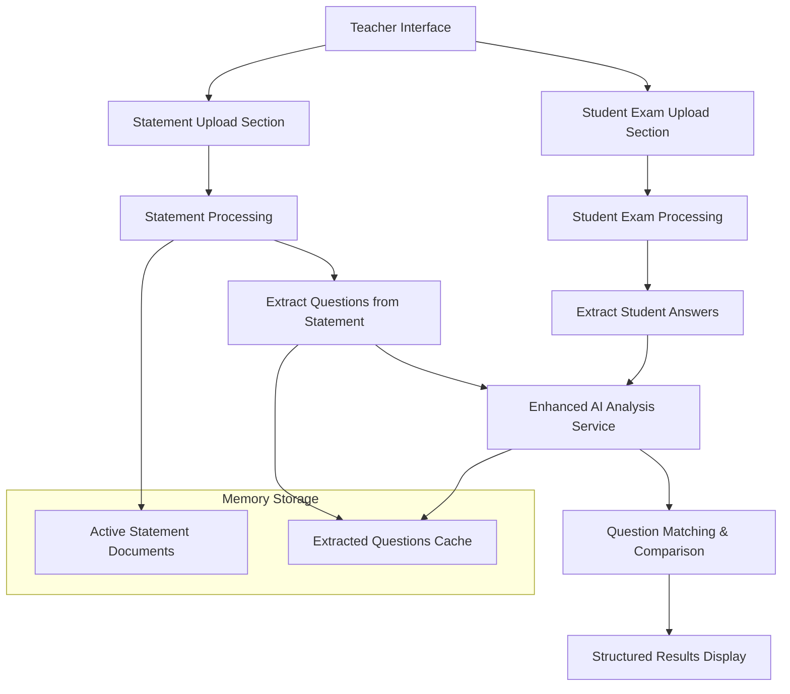
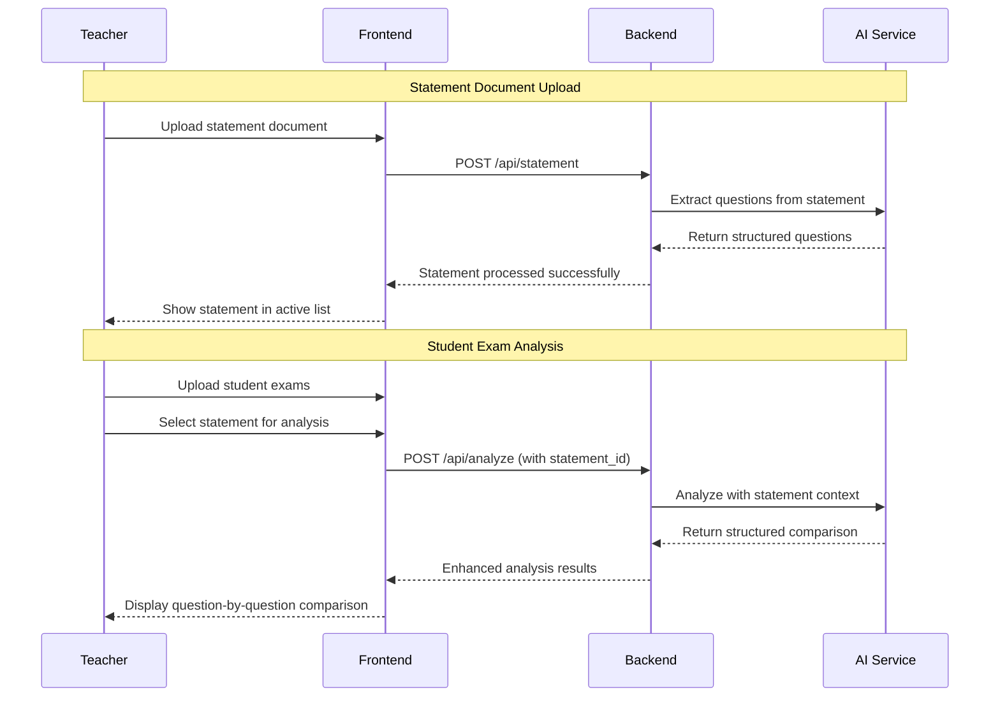

# Statement Document Feature Implementation Plan

## Overview
Add functionality to the Course Checker application to include statement documents (énoncés) that contain the original exam questions. This will enable the AI to provide more accurate analysis by comparing student answers against the expected questions and solutions.

## Requirements Summary
- **Statement Management**: Dedicated section for statement documents that can be reused for multiple student exams
- **Storage**: In-memory/temporary storage (no persistence between server restarts)
- **Analysis**: Structured question-by-question comparison showing expected answers vs student answers
- **UI**: Separate section for statement document management

## Architecture Overview



## Implementation Components

### 1. Frontend Changes

#### HTML Interface (`public/index.html`)
- Add new statement document section above current upload area
- Statement document management interface with:
  - Upload area for statement documents
  - List of active statement documents
  - Statement selection dropdown for exam analysis
  - Delete/clear statement options

#### JavaScript (`public/script.js`)
- Statement document upload handling
- Statement selection interface
- Enhanced results display for question-by-question comparison
- Statement management (list, select, delete)

#### CSS (`public/styles.css`)
- Styling for statement document section
- Enhanced results display styling
- Statement selection interface styling

### 2. Backend Changes

#### API Endpoints (`server.js`)
```javascript
// New endpoints
POST /api/statement          // Upload and process statement document
GET /api/statements          // List active statement documents  
DELETE /api/statement/:id    // Remove statement document from memory

// Modified endpoint
POST /api/analyze            // Enhanced to include optional statement_id
```

#### Statement Service (`services/statementService.js`) - NEW
```javascript
class StatementService {
    constructor() {
        this.documents = new Map();     // id -> statement data
        this.questionCache = new Map(); // statementId -> extracted questions
        this.activeStatement = null;    // currently selected statement ID
    }
    
    // Core methods
    async processStatement(file)
    async extractQuestions(statementId)
    getActiveStatements()
    selectStatement(id)
    removeStatement(id)
    cleanup()
}
```

#### Enhanced AI Service (`services/aiService.js`)
```javascript
// New methods
async extractQuestionsFromStatement(images, filename)
async analyzeExamWithStatement(studentImages, statementQuestions, filename)
async matchQuestionsToAnswers(questions, studentContent)

// Enhanced analysis with structured comparison
```

### 3. Memory Storage Structure

```javascript
const statementStore = {
    documents: new Map(), // id -> {
        //   id: "stmt_123",
        //   filename: "exam_statement.pdf", 
        //   content: "extracted text content",
        //   questions: [...], // structured questions
        //   timestamp: "2024-01-01T00:00:00Z"
        // }
    activeStatement: null, // currently selected statement ID
    questionCache: new Map() // statementId -> extracted questions array
};
```

## Implementation Phases

### Phase 1: Backend Foundation
1. **Create Statement Service**
   - In-memory storage implementation
   - Statement document processing
   - Question extraction using AI
   - Lifecycle management utilities

2. **Add API Endpoints**
   - Statement upload endpoint with file processing
   - Statement management endpoints (list, delete)
   - Modify existing analyze endpoint to accept statement_id

3. **Enhance AI Service**
   - Add statement question extraction method
   - Create enhanced analysis method with statement context
   - Implement question matching algorithm

### Phase 2: Frontend Integration
1. **Update HTML Interface**
   - Add statement document section with upload area
   - Create statement management UI (list, select, delete)
   - Add statement selection dropdown for analysis
   - Update results section for enhanced display

2. **Enhance JavaScript**
   - Statement upload functionality with progress tracking
   - Statement selection and management handling
   - Enhanced results display for question-by-question comparison
   - Error handling for statement operations

### Phase 3: Enhanced Analysis & UI Polish
1. **Question Matching Algorithm**
   - Intelligent matching of student answers to statement questions
   - Handle partial matches and question variations
   - Provide confidence scores for matches

2. **Structured Results Enhancement**
   - Question-by-question comparison display
   - Visual indicators for correct/incorrect answers
   - Detailed feedback per question
   - Overall summary with statement context

## Technical Specifications

### API Request/Response Formats

#### Statement Upload
```javascript
POST /api/statement
Content-Type: multipart/form-data

Response: {
    success: true,
    statement: {
        id: "stmt_123",
        filename: "exam_statement.pdf",
        questions_extracted: 5,
        timestamp: "2024-01-01T00:00:00Z"
    }
}
```

#### Enhanced Analysis
```javascript
POST /api/analyze
Content-Type: multipart/form-data
Body: {
    files: [...],           // student exam files
    statement_id: "stmt_123" // optional statement reference
}

Response: {
    success: true,
    results: [{
        filename: "student_exam.pdf",
        analysis: {
            overall_score: 85,
            statement_used: "Math_Exam_Chapter_5.pdf",
            question_analysis: [
                {
                    question_number: 1,
                    statement_question: "Solve for x: 2x + 3 = 11",
                    expected_answer: "x = 4",
                    student_answer: "x = 4",
                    is_correct: true,
                    score: 100,
                    feedback: "Perfect solution with clear steps"
                },
                {
                    question_number: 2,
                    statement_question: "Calculate the derivative of f(x) = x²",
                    expected_answer: "f'(x) = 2x",
                    student_answer: "f'(x) = 2x + 1",
                    is_correct: false,
                    score: 0,
                    feedback: "Incorrect: forgot that derivative of constant is 0"
                }
            ],
            summary: "Strong understanding of algebra, needs review of calculus basics"
        }
    }]
}
```

### User Experience Flow



### File Structure Changes

```
course_checker/
├── server.js                 # Enhanced with statement endpoints
├── services/
│   ├── fileProcessor.js      # Existing file processing
│   ├── aiService.js          # Enhanced with statement analysis
│   └── statementService.js   # NEW - Statement document management
├── public/
│   ├── index.html            # Enhanced UI with statement section
│   ├── script.js             # Enhanced with statement handling
│   └── styles.css            # Enhanced styling for new features
└── uploads/                  # Temporary storage (existing)
```

## Key Features & Benefits

### For Teachers
1. **Reusable Statements**: Upload once, use for multiple student exams
2. **Accurate Analysis**: AI has context of original questions
3. **Detailed Feedback**: Question-by-question comparison
4. **Easy Management**: Simple interface for statement selection

### For Students (Indirect)
1. **Better Feedback**: More accurate error identification
2. **Structured Results**: Clear understanding of mistakes per question
3. **Educational Value**: See expected vs actual answers

### Technical Benefits
1. **Lightweight**: In-memory storage keeps system simple
2. **Scalable**: Easy to extend with additional features
3. **Maintainable**: Clean separation of concerns
4. **Performance**: Fast access to statement data

## Implementation Considerations

### Memory Management
- Automatic cleanup of old statement documents
- Configurable memory limits
- Graceful handling of memory constraints

### Error Handling
- Robust file upload validation
- AI service error recovery
- User-friendly error messages

### Security
- File type validation for statement documents
- Size limits for uploads
- Input sanitization

### Performance
- Efficient question matching algorithms
- Caching of extracted questions
- Optimized AI API calls

## Future Enhancements (Out of Scope)
- Persistent storage for statement documents
- Statement document versioning
- Collaborative statement sharing
- Advanced question type recognition
- Integration with learning management systems

## Success Criteria
- [ ] Teachers can upload statement documents successfully
- [ ] Statement documents are processed and questions extracted
- [ ] Teachers can select statements for student exam analysis
- [ ] Enhanced analysis provides question-by-question comparison
- [ ] Results display shows structured comparison clearly
- [ ] System handles multiple statement documents in memory
- [ ] Clean user interface for statement management

This plan provides a comprehensive roadmap for implementing the statement document feature while maintaining the simplicity and effectiveness of the existing Course Checker application.